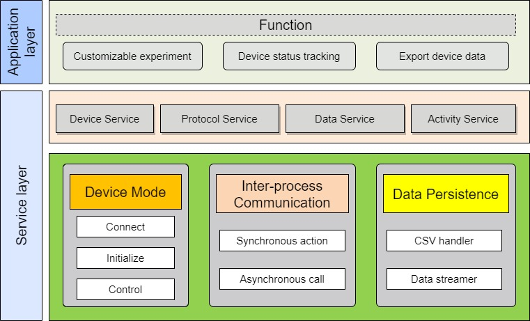
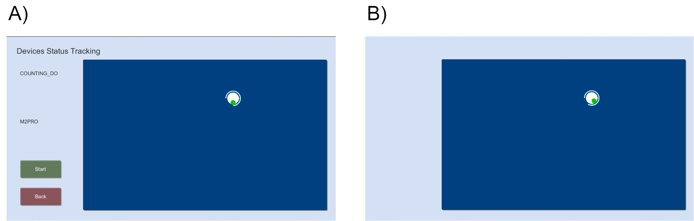
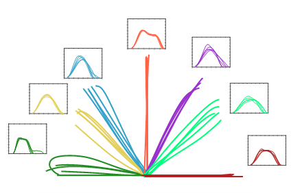

# **Summary:**

It has been shown that resistance affects the motor control strategies of humans(Gottlieb 1996). Previous RCTs also confirmed the therapeutic effect of resistance training(Flansbjer, Lexell, and Brogårdh 2012)(Ouellette et al. 2004). Current studies may be stuck in the precise control of the dynamic parameters(Gambassi, Coelho-Junior, and Schwingel, n.d.).

Having a software to create the ideal dynamic environment is essential for further studies in biomechanics, motor control, and clinical research. Here we introduce X-Controller, a self-design application in order to create different dynamic situations and collect kinematic data of upper extremity on the commercial upper limb rehabilitation robot.

# Statement of need

To fulfill different purposes of studies, researchers struggle to create different dynamic situations in a real-life scenario, such as adding weight to the barbells or using elastic strings. Firstly, this method can&#39;t realize the continuous control of dynamic parameters, for instance, the minimum control unit of the barbells is the weight of the smallest plates. Secondly, some properties of resistance are hard to be created, such as the viscous load or the inertial load in the horizontal plane. Some researchers may use the self-design machine to simulate different dynamic situations. This also brings about some other problems, many researchers suffer from insufficient equipment, the high prior-period investment, and the potential instrumental error.

Functions of existing software may be used to solve some of these problems, such as LabVIEW(Bishop 2000) and psychopy(Peirce 2007).LabVIEW is a graphical dataflow programming environment for the integration of hardware. It has strength in driving robot, but weakness in study design. What&#39;s more, LabVIEW shows more applicability in engineering, rather than scientific research. Psychopy is a psychophysics software developed in python for experimental arrangement. It has advantages in study design, but needs extra programming to drive a robot. Until now, researchers haven&#39;t had software that gears to the scientific purpose yet.

Thus, we introduce X-Controller, the self-design application developed by unity to create different dynamic environment and collect kinematic data on the commercial upper limb rehabilitation robot. Compared to the software above, X-Controller is designed only for scientific research, which is capable of driving robots, experimental design, and collecting data. It has applications in the mechanic research, the clinical practice, and the clinical study.

In the field of the motor control study, X-Controller provides a way for direct control of the robot to create different dynamic environment, including the magnitude of resistance, the property of resistance, and the movement trajectories. X-Controller not only simulate both the inertial and viscous load but also realize the continuous control of applied load just by typing the keyboard. Using X-Controller, researchers are freed from the heavy experiment preparations (such as lifting 30Kg weight plates) and create the expecting environment in minutes. In the field of clinical practice, X-Controller simplifies the customization of movement trajectory and resistance. It enables the therapists who don&#39;t have any programming capability to set dynamic parameters using a user interface。 In the field of clinical study, X-Controller is developed based on the commercial upper limb rehabilitation robot – M2pro (Fourier Intelligence inc., Shanghai, China). Based on the initial code, X-Controller can get access to most of commercial robots on the market. This may narrow the instrumental error in the multicenter-clinical trials and the bias in the future META analysis.

# **Software overview**

The overall structure chart is shown in Figure 1.

Figure 1. The structure chart of X-Controller.

X-Controller has three different functional modules, including the customization of movement, device status tracking, and the extraction of kinematic data.

The main UI of X-Controller is shown in Figure 2.

Figure 2. The main UI of X-Controller.

X-Controller customizes movement tracks through the grip of M2pro based on the default trial-based paradigm, which is a point-to-point movement. Researchers can freely set the location of start-point and end-point by the user interface within the range of the operation platform (52cm \* 36cm). what&#39;s more, as shown in Figure 2.B, X-Controller also provides a visual feedback during the movement trials, displaying the real-time position of the grip and the targets.

X-Controller can extract the kinematic data of the grip of M2pro in 25Hz maximum, including the location and force in two-dimensional coordinate. Meanwhile, X-Controller also outputs the corresponding state of the finite state machine in each observation point. Based on that, researchers can split the whole kinematic data into every point-to-point movement, which is really convenient for the following analysis including motor learning, muscle synergy calculation, and collaborative analysis. All data extracted is saved in .csv format.

# **Experimental example**

To demonstrate the function of X-Controller, we collected one set of kinematic data in Ruijin Hospital.

The subject (the author himself) was asked to move towards from start-point to seven different targets set by the therapist who doesn&#39;t have any knowledge of programming. The trajectories and velocity profiles are shown in Fig2.

Figure 3. The data sample of X-Controller.

# **Acknowledgement**

# **Reference**

Bishop, Robert H. 2000. _Learning with LabVIEW_. 3. print., Student ed. Menlo Park, Calif.: Addison-Wesley Longman.

Flansbjer, U, J Lexell, and C Brogårdh. 2012. &quot;Long-Term Benefits of Progressive Resistance Training in Chronic Stroke: A 4-Year Follow-Up.&quot; _Journal of Rehabilitation Medicine_ 44 (3): 218–21. <https://doi.org/10.2340/16501977-0936>.

Gambassi, Bruno Bavaresco, Hélio José Coelho-Junior, and Paulo Adriano Schwingel. n.d. &quot;Resistance Training and Stroke: A Critical Analysis of Different Training Programs.&quot; _Stroke Research and Treatment_, 12.

Gottlieb, G. L. 1996. &quot;On the Voluntary Movement of Compliant (Inertial-Viscoelastic) Loads by Parcellated Control Mechanisms.&quot; _Journal of Neurophysiology_ 76 (5): 3207–29. <https://doi.org/10.1152/jn.1996.76.5.3207>.

Ouellette, Michelle M., Nathan K. LeBrasseur, Jonathan F. Bean, Edward Phillips, Joel Stein, Walter R. Frontera, and Roger A. Fielding. 2004. &quot;High-Intensity Resistance Training Improves Muscle Strength, Self-Reported Function, and Disability in Long-Term Stroke Survivors.&quot; _Stroke_ 35 (6): 1404–9. <https://doi.org/10.1161/01.STR.0000127785.73065.34>.

Peirce, Jonathan W. 2007. &quot;PsychoPy—Psychophysics Software in Python.&quot; _Journal of Neuroscience Methods_ 162 (1–2): 8–13. <https://doi.org/10.1016/j.jneumeth.2006.11.017>.
