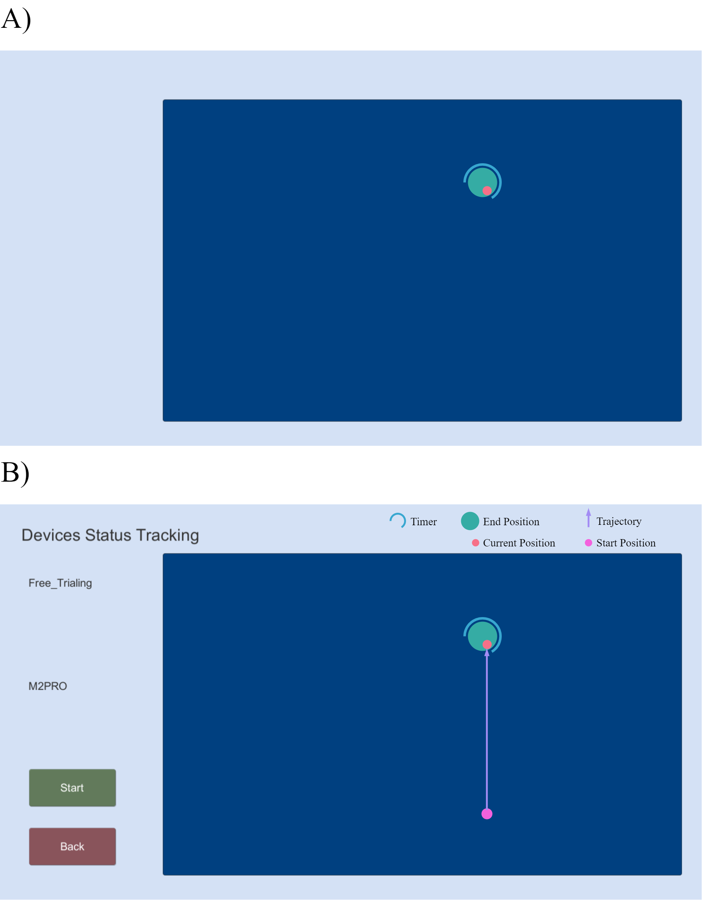

# Summary

Resistance training has shown efficacy in post-stroke rehabilitation. To understand which aspects of resistance (i.e. magnitude, type) play an important role in movement rehabilitation, haptic robots are widely used for simulation of resistance due to easy tweaking of mechanical parameters. Although adjustment of robot-delivered resistance can be achieved by direct modification on the source code, it would be much more efficient if the configuration can be integrated into a standalone toolkit. Therefore we have developed ReMove, a programmable application for customization of robot-delivered resistance and robot-guided movements on rehabilitation robots. ReMove provides a plain-text interface that specifies the robot behavior during each trial of movement, and it renders both the graphical and mechanical specs during the movement. By the time of submission, ReMove had been supporting 2 clinical studies. Pilot data supported the feasibility and utility of ReMove in movements against light and heavy resistance.

# Statement of need

Previous studies have shown the therapeutic effect of resistance training, including the improvement of gait speed(Mehta et al. 2012), muscle strength(U Flansbjer, Lexell, and Brogårdh 2012), perceived participation(Ub Flansbjer et al. 2008), etc. It becomes interesting to test which aspects of mechanical resistance could elicit physiological responses that are beneficial. This line of studies requires easy tweaking of resistance, including the change of type, magnitude, and timing of resistance. A major challenge for this, however,  is the generation of different types of resistance, e.g. it is cumbersome to prepare viscosity in real-world setups. The second challenge arises in flexibly changing the parameters using real-world objects, e.g. alternating between heavy and light resistance across trials.

Simulation of resistance using haptic robots are advantageous for learning the sensorimotor control in humans. The properties of resistance can be changed in the source code on demand. The disadvantage is also obvious that most clinical researchers lack the knowledge of programming. Although the barrier may be lowered for robot programming by use of graphical environments (LabVIEW, Simulink) or tools for experiment customization (E-Prime, PsychoPy), no existing software caters to the need of simulation and coordination of resistance in rehabilitation studies.

Here we introduce ReMove, a programmable application for the customization of robot-delivered resistance and robot-guided movements on haptic robots. The main value of ReMove is to provide an integrated research environment that allowed both generation and manipulation of resistance during human upper-limb movements. Using ReMove, it would significantly reduce the time to prepare an experiment that needs trial-by-trial modification on resistance.

# Software overview

The architecture of ReMove is shown in \autoref{fig:1}. Notice that the experimental setups are specified through the Parameter Interfaces, and most of the logics are programmed in the module of device synchronization. Modules communicate asynchronously for better performance. The current version of ReMove is adapted to M2PRO, a 2D haptic robot licensed for clinical use in China (Fourier Intelligence inc., Shanghai, China). The support will expand to other available makes and models including Phantom series, HapticMASTER, etc.

{#fig:1 width="75%"}

ReMove allows researchers to customize the following parameters using plain-text (.csv format in the existing version):

1. The location of the starting point.
2. The location of the target.
3. The type of resistance.
4. The magnitude of resistance.

During each trial of movement, ReMove renders the graphical details corresponding to the .csv files. Both a subject view (\autoref{fig:2}A, minimal display of experimental status) an inspector view (\autoref{fig:2}B, rich information about experimental status) are rendered.

{#fig:2 width="75%"}

# Experimental example

We accomplished pilot experiments with a volunteer. The volunteer was asked to move from a starting point (close to his chest) to 7 different targets (25cm away) under 2 levels of inertial load. Parameter setting was accomplished by a therapist naïve of computer programming. The parameter setting took about 5 minutes. \autoref{fig:3} shows that the volunteer performed straight movements. Notice that the peak-velocity decreased (\autoref{fig:3}B) due to the increased magnitude of resistance.

# Acknowledgements

The authors thank Yongjun Qiao for help with the design and test of ReMove. This work is funded by the General Project of National Natural Science Foundation of China (81971722); Shanghai Science and Technology Commission Project (19511105600); Shanghai Municipal Health Commission Project (2019SY004).

# References

Flansbjer, U, J Lexell, and C Brogårdh. 2012. &quot;Long-Term Benefits of Progressive Resistance Training in Chronic Stroke: A 4-Year Follow-Up.&quot; _Journal of Rehabilitation Medicine_ 44 (3): 218–21. <https://doi.org/10.2340/16501977-0936>.

Flansbjer, Ub, M Miller, D Downham, and J Lexell. 2008. &quot;Progressive Resistance Training after Stroke: Effects on Muscle Strength, Muscle Tone, Gait Performance and Perceived Participation.&quot; _Journal of Rehabilitation Medicine_ 40 (1): 42–48. <https://doi.org/10.2340/16501977-0129>.

Mehta, Swati, Shelialah Pereira, Ricardo Viana, Rachel Mays, Amanda McIntyre, Shannon Janzen, and Robert W. Teasell. 2012. &quot;Resistance Training for Gait Speed and Total Distance Walked During the Chronic Stage of Stroke: A Meta-Analysis.&quot; _Topics in Stroke Rehabilitation_ 19 (6): 471–78. <https://doi.org/10.1310/tsr1906-471>.
